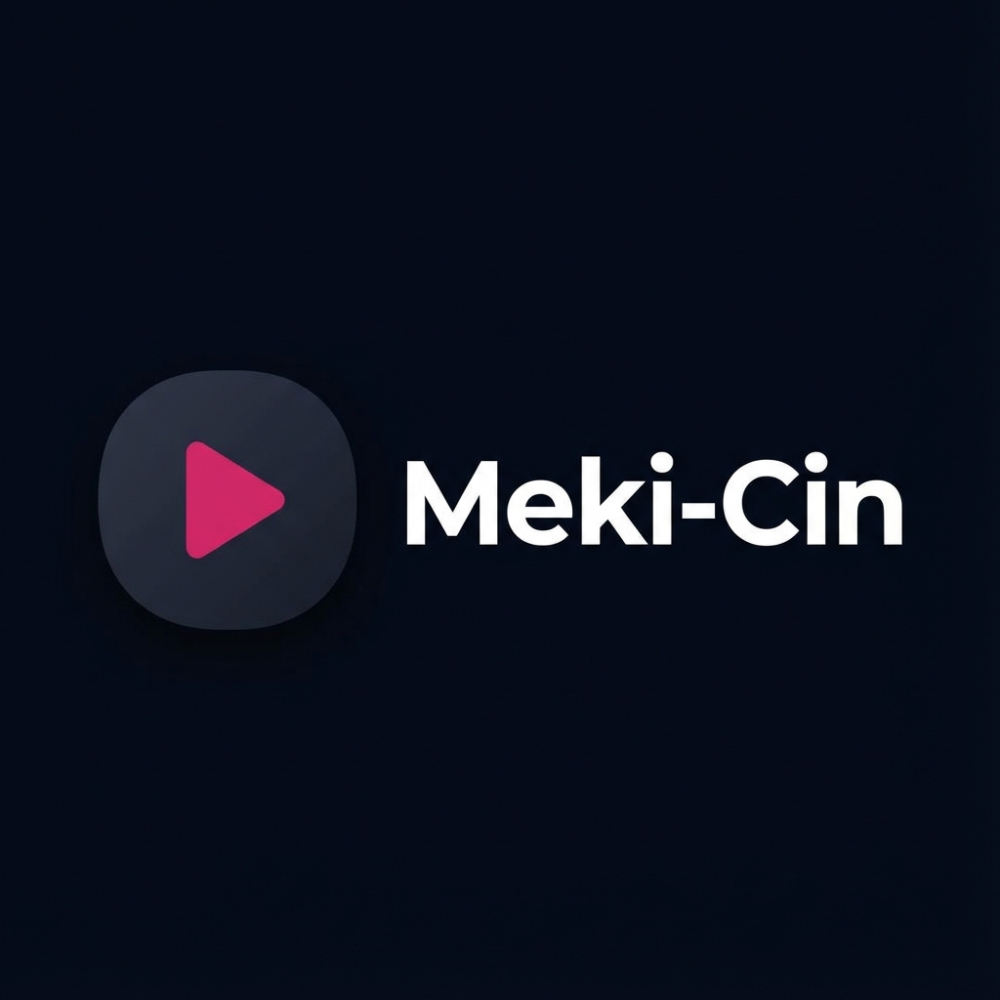

# 🎬 Meki-Cin - Chinese Drama Streaming Platform

A modern, responsive web application for streaming Chinese Dramas (Drachin), built with **Next.js**, **Tailwind CSS**, and **Framer Motion**.



## ✨ Features

-   **immersive UI/UX**:
    -   Full-screen Hero section with trending content.
    -   Smooth page transitions and scroll animations using `framer-motion`.
    -   Glassmorphism effects on Navbar and overlays.
-   **Video Streaming**:
    -   Custom Video Player with Play/Pause, Progress Bar, and Fullscreen toggle.
    -   Episode navigation accordion.
    -   "Lights off" / Expanded theater mode.
-   **Content Discovery**:
    -   **Trending Now**: Top-rated dramas.
    -   **Latest Updates**: Recently added episodes.
    -   **Search**: Real-time search functionality with animated overlay.
-   **Favorites System** ❤️:
    -   Save dramas to your "My List".
    -   Persisted using `localStorage`.
    -   Real-time synchronization across tabs and components.
-   **Responsive Design**: Fully optimized for Desktop, Tablet, and Mobile devices.

## 🛠️ Tech Stack

-   **Framework**: [Next.js 14+](https://nextjs.org/) (App Router)
-   **Styling**: [Tailwind CSS](https://tailwindcss.com/)
-   **Icons**: [Lucide React](https://lucide.dev/)
-   **Animations**: [Framer Motion](https://www.framer.com/motion/)
-   **State Management**: React Hooks (`useState`, `useEffect`, Custom Hooks)

## 🚀 Getting Started

1.  **Clone the repository**:
    ```bash
    git clone https://github.com/your-username/drakor-china.git
    cd drakor-china
    ```

2.  **Install dependencies**:
    ```bash
    npm install
    # or
    yarn install
    ```

3.  **Run the development server**:
    ```bash
    npm run dev
    ```

4.  Open [http://localhost:3000](http://localhost:3000) with your browser to see the result.

## 📂 Project Structure

-   `src/views`: Page components (HomePage, DetailPage, StreamPage).
-   `src/components`: Reusable UI components (Navbar, VideoPlayer).
-   `src/hooks`: Custom hooks (useFavorites).
-   `app`: Next.js App Router structure.

## 📝 License

This project is for educational and entertainment purposes. Content is subject to copyright of their respective owners.
